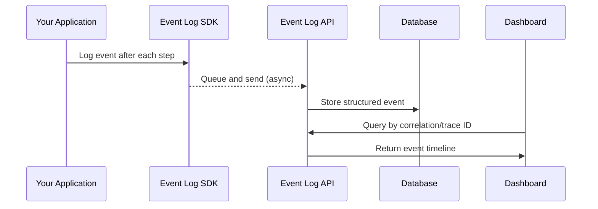

# What is Event Logging

## The Problem

Modern business processes span multiple microservices. A single order might touch an API gateway, an inventory service, a payment provider, and a fulfillment system. When something fails at step 3 of 5, teams struggle to answer basic questions:

- **What happened?** — Application logs are scattered across services, each with its own format.
- **Where did it fail?** — Finding the right log line means searching across multiple systems with different retention policies.
- **Why did it fail?** — Technical stack traces don't capture the business context. A `NullPointerException` tells you nothing about the customer's order.
- **What was the impact?** — Without a unified view, there's no way to quickly see how many orders were affected.

Traditional application logs were designed for debugging code, not for understanding business processes.

## The Solution

The Event Log Platform captures **structured events** at each step of a business process, tied together by correlation IDs and trace IDs. Every event includes:

- A **human-readable summary** that describes what happened in business terms
- **Business identifiers** (order ID, customer ID, account number) for fast lookup
- **Timing data** to measure how long each step takes
- **Status and result** to know the outcome at a glance

Instead of searching through raw logs, you get a clear timeline of exactly what happened to a specific order, customer, or account.

## How It Works

1. **Your application** calls the SDK after each business step completes (order validated, payment charged, etc.)
2. **The SDK** queues the event and sends it asynchronously — it never blocks your business logic
3. **The API** validates and stores the event with its identifiers and relationships
4. **The Dashboard** lets you search by account, order ID, or any business identifier and see the full process timeline

## Event Logging vs Application Logging

Event logs and application logs serve different purposes. They complement each other.

| | **Event Logs** | **Application Logs** |
|---|---|---|
| **Purpose** | Capture business process flow | Capture technical operations |
| **Audience** | Business analysts, support teams, developers | Developers, SREs |
| **Content** | "Order #1234 validated, inventory reserved for 3 items" | `DEBUG: OrderService.validate() called with id=1234` |
| **Structure** | Consistent schema with typed fields | Free-form text, varies by framework |
| **Correlation** | Built-in correlation IDs tie events across services | Requires manual trace propagation |
| **Retention** | Long-term (business audit trail) | Short-term (operational debugging) |
| **Granularity** | One event per business step | Many lines per operation (debug, info, warn, error) |

**Use event logs** when you need to answer: *"What happened to this order/customer/account?"*

**Use application logs** when you need to answer: *"Why did this line of code throw an exception?"*

## Key Terminology

| Term | Definition |
|---|---|
| **Event** | A single structured record capturing one step in a business process. |
| **Process** | A named business workflow (e.g., `ORDER_PROCESSING`, `USER_ONBOARDING`). A process consists of multiple events. |
| **Trace** | A group of events sharing the same `trace_id`, representing a complete business process. The `trace_id` is the primary identifier used by the dashboard. |
| **Correlation ID** | A team-defined custom label for a process instance (e.g., `add-auth-user-abc123`). Used alongside `trace_id` for human-readable identification and account linking. |
| **Span** | A single operation within a trace, identified by a `span_id`. Spans form a hierarchy via `parent_span_id`. |

## Next Steps

- [Event Model](/concepts/event-model) — Learn the anatomy of an event, event types, and the identifier hierarchy
- [Your First Trace](/concepts/your-first-trace) — Walk through a complete example with Java SDK code and resulting event data
