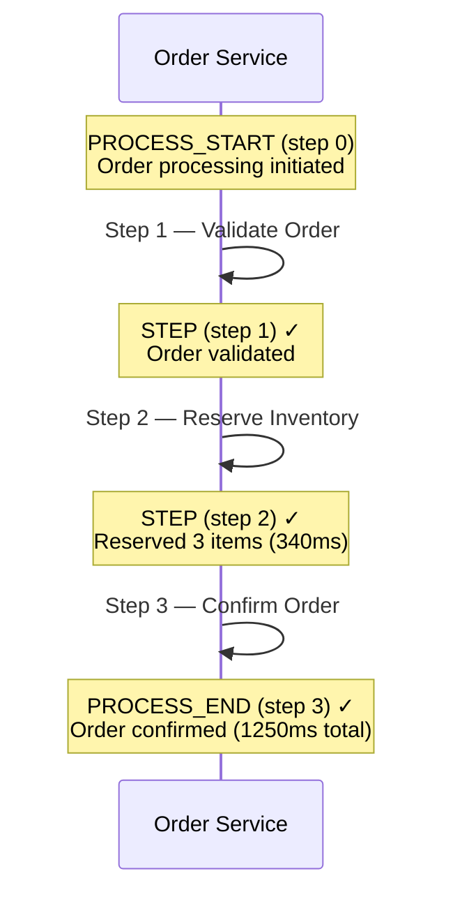
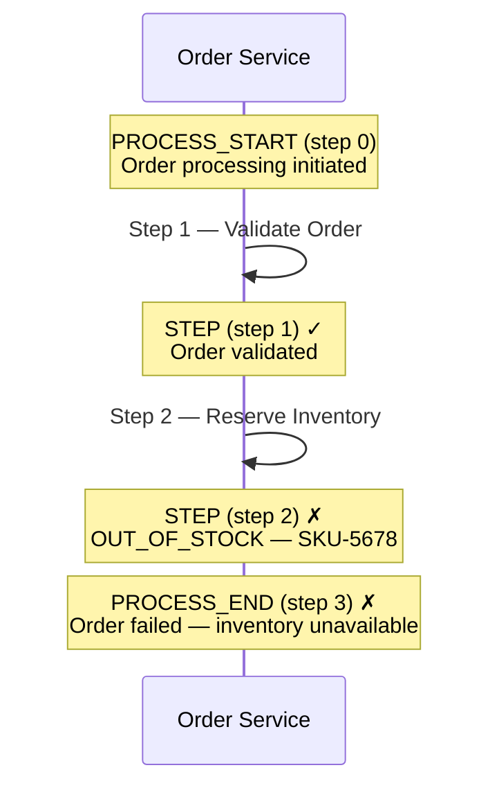

# Your First Trace

This walkthrough shows a complete order processing scenario using the Java SDK — from code to the resulting event data. By the end, you'll understand exactly what events look like and how they connect.

## Scenario

A simple **ORDER_PROCESSING** flow with three steps:

1. **Validate Order** — Check that items exist and prices are correct
2. **Reserve Inventory** — Hold items at the warehouse
3. **Confirm Order** — Finalize the order and notify the customer

## Java SDK Code

```java
@Service
public class OrderService {
    private final EventLogTemplate template;

    public OrderService(EventLogTemplate template) {
        this.template = template;
    }

    public void processOrder(Order order) {
        // correlation_id and trace_id are read from MDC automatically
        ProcessLogger process = template.forProcess("ORDER_PROCESSING")
            .addIdentifier("order_id", order.getId())
            .addIdentifier("customer_id", order.getCustomerId());

        // Process start — step 0
        process.processStart(
            "Order processing initiated for order " + order.getId()
                + " — " + order.getItemCount() + " items, $" + order.getTotal(),
            "INITIATED"
        );

        // Step 1: Validate order
        var validation = validateOrder(order);
        process.logStep(1, "Validate Order", EventStatus.SUCCESS,
            "Order " + order.getId() + " validated — "
                + order.getItemCount() + " items, total $" + order.getTotal(),
            "VALIDATED");

        // Step 2: Reserve inventory
        var reservation = reserveInventory(order);
        process.addIdentifier("reservation_id", reservation.getId());
        process.withExecutionTimeMs(reservation.getDurationMs())
            .logStep(2, "Reserve Inventory", EventStatus.SUCCESS,
                "Reserved " + order.getItemCount() + " items at warehouse "
                    + reservation.getWarehouseId(),
                "RESERVED");

        // Step 3: Confirm order (process end)
        confirmOrder(order, reservation);
        process.processEnd(3, EventStatus.SUCCESS,
            "Order " + order.getId() + " confirmed — shipping from "
                + reservation.getWarehouseId(),
            "COMPLETED", 1250);
    }
}
```

::: tip Log after each step
Each `logStep()` call fires immediately and asynchronously. If your process crashes at step 3, steps 1 and 2 are already recorded.
:::

## What Gets Logged

The code above produces 4 events. Here's what each one looks like in the API:

### Event 1: Process Start

```json
{
  "correlation_id": "a1b2c3d4e5f6a7b8c9d0e1f2a3b4c5d6",
  "trace_id": "order-20250301-x7k9m2",
  "process_name": "ORDER_PROCESSING",
  "step_sequence": 0,
  "step_name": null,
  "event_type": "PROCESS_START",
  "event_status": "SUCCESS",
  "summary": "Order processing initiated for order ORD-2025-1234 — 3 items, $89.97",
  "result": "INITIATED",
  "identifiers": {
    "order_id": "ORD-2025-1234",
    "customer_id": "CUST-5678"
  },
  "application_id": "order-service",
  "event_timestamp": "2025-03-01T14:30:00.000Z"
}
```

### Event 2: Validate Order

```json
{
  "correlation_id": "a1b2c3d4e5f6a7b8c9d0e1f2a3b4c5d6",
  "trace_id": "order-20250301-x7k9m2",
  "process_name": "ORDER_PROCESSING",
  "step_sequence": 1,
  "step_name": "Validate Order",
  "event_type": "STEP",
  "event_status": "SUCCESS",
  "summary": "Order ORD-2025-1234 validated — 3 items, total $89.97",
  "result": "VALIDATED",
  "identifiers": {
    "order_id": "ORD-2025-1234",
    "customer_id": "CUST-5678"
  },
  "application_id": "order-service",
  "event_timestamp": "2025-03-01T14:30:00.150Z"
}
```

### Event 3: Reserve Inventory

```json
{
  "correlation_id": "a1b2c3d4e5f6a7b8c9d0e1f2a3b4c5d6",
  "trace_id": "order-20250301-x7k9m2",
  "process_name": "ORDER_PROCESSING",
  "step_sequence": 2,
  "step_name": "Reserve Inventory",
  "event_type": "STEP",
  "event_status": "SUCCESS",
  "summary": "Reserved 3 items at warehouse WH-EAST",
  "result": "RESERVED",
  "identifiers": {
    "order_id": "ORD-2025-1234",
    "customer_id": "CUST-5678",
    "reservation_id": "RSV-9012"
  },
  "execution_time_ms": 340,
  "application_id": "order-service",
  "event_timestamp": "2025-03-01T14:30:00.500Z"
}
```

### Event 4: Process End

```json
{
  "correlation_id": "a1b2c3d4e5f6a7b8c9d0e1f2a3b4c5d6",
  "trace_id": "order-20250301-x7k9m2",
  "process_name": "ORDER_PROCESSING",
  "step_sequence": 3,
  "step_name": null,
  "event_type": "PROCESS_END",
  "event_status": "SUCCESS",
  "summary": "Order ORD-2025-1234 confirmed — shipping from WH-EAST",
  "result": "COMPLETED",
  "identifiers": {
    "order_id": "ORD-2025-1234",
    "customer_id": "CUST-5678",
    "reservation_id": "RSV-9012"
  },
  "execution_time_ms": 1250,
  "application_id": "order-service",
  "event_timestamp": "2025-03-01T14:30:01.250Z"
}
```

Notice how:
- All 4 events share the same `correlation_id` and `trace_id`
- `step_sequence` increments with each step (0, 1, 2, 3)
- The `reservation_id` identifier appears starting at event 3 — identifiers stack forward
- `execution_time_ms` is only present on events where it was explicitly set

## Trace Timeline

Here's how these events look as a timeline:



## Error Scenario

Now let's say inventory reservation fails — the warehouse is out of stock. This is a **known business error**, so we use `logStep(FAILURE)` to preserve step context, then `processEnd(FAILURE)` to formally close the process:

```java
public void processOrder(Order order) {
    ProcessLogger process = template.forProcess("ORDER_PROCESSING")
        .addIdentifier("order_id", order.getId())
        .addIdentifier("customer_id", order.getCustomerId());

    process.processStart(
        "Order processing initiated for order " + order.getId()
            + " — " + order.getItemCount() + " items, $" + order.getTotal(),
        "INITIATED");

    // Step 1 succeeds
    validateOrder(order);
    process.logStep(1, "Validate Order", EventStatus.SUCCESS,
        "Order " + order.getId() + " validated — "
            + order.getItemCount() + " items, total $" + order.getTotal(),
        "VALIDATED");

    // Step 2 fails — known business error
    try {
        reserveInventory(order);
    } catch (OutOfStockException e) {
        // Layer 1: Record the failed step WITH step context
        process.withErrorCode("OUT_OF_STOCK")
            .withErrorMessage(e.getMessage())
            .logStep(2, "Reserve Inventory", EventStatus.FAILURE,
                "Inventory reservation failed — item " + e.getSkuId()
                    + " out of stock at all warehouses",
                "FAILED");

        // Layer 2: Formally close the process as failed
        process.processEnd(3, EventStatus.FAILURE,
            "Order " + order.getId() + " failed — inventory unavailable",
            "FAILED", null);

        throw e;
    }
}
```

This produces 4 events. The first two are the same as before. Instead of an ERROR event with no step context, we get a STEP (failure) and a PROCESS_END (failure):

### Event 3: Failed Step

```json
{
  "correlation_id": "a1b2c3d4e5f6a7b8c9d0e1f2a3b4c5d6",
  "trace_id": "order-20250301-x7k9m2",
  "process_name": "ORDER_PROCESSING",
  "step_sequence": 2,
  "step_name": "Reserve Inventory",
  "event_type": "STEP",
  "event_status": "FAILURE",
  "summary": "Inventory reservation failed — item SKU-5678 out of stock at all warehouses",
  "result": "FAILED",
  "error_code": "OUT_OF_STOCK",
  "error_message": "SKU-5678 is not available in any warehouse",
  "identifiers": {
    "order_id": "ORD-2025-1234",
    "customer_id": "CUST-5678"
  },
  "application_id": "order-service",
  "event_timestamp": "2025-03-01T14:30:00.500Z"
}
```

### Event 4: Process End (Failure)

```json
{
  "correlation_id": "a1b2c3d4e5f6a7b8c9d0e1f2a3b4c5d6",
  "trace_id": "order-20250301-x7k9m2",
  "process_name": "ORDER_PROCESSING",
  "step_sequence": 3,
  "step_name": null,
  "event_type": "PROCESS_END",
  "event_status": "FAILURE",
  "summary": "Order ORD-2025-1234 failed — inventory unavailable",
  "result": "FAILED",
  "identifiers": {
    "order_id": "ORD-2025-1234",
    "customer_id": "CUST-5678"
  },
  "application_id": "order-service",
  "event_timestamp": "2025-03-01T14:30:00.510Z"
}
```

::: tip Step context enables automated diagnosis
Notice that `step_sequence: 2` and `step_name: "Reserve Inventory"` are preserved on the failure event. An AI agent parsing these logs can immediately identify *which* step failed and *why* — no guesswork required. This is the key difference from using `error()`, which always sets `step_sequence` and `step_name` to `null`.
:::

The error timeline:



In the Dashboard, support engineers and AI agents can immediately see that this order failed at step 2 "Reserve Inventory" with error code `OUT_OF_STOCK` — no log diving required.

## Catch-All Errors

Not every failure is a known business error like `OUT_OF_STOCK`. Sometimes an unhandled exception escapes your business logic entirely — a `NullPointerException`, a database timeout, or a serialization bug. The `error()` method is the outermost safety net for these cases. When an AI agent sees `step_sequence: null`, it knows the failure was unhandled and will escalate for human investigation.

Here's the complete pattern showing all 3 layers of error handling together:

```java
public void processOrder(Order order) {
    ProcessLogger process = template.forProcess("ORDER_PROCESSING")
        .addIdentifier("order_id", order.getId())
        .addIdentifier("customer_id", order.getCustomerId());

    try {
        process.processStart(
            "Order processing initiated for order " + order.getId()
                + " — " + order.getItemCount() + " items, $" + order.getTotal(),
            "INITIATED");

        // Step 1: Validate order
        validateOrder(order);
        process.logStep(1, "Validate Order", EventStatus.SUCCESS,
            "Order " + order.getId() + " validated", "VALIDATED");

        // Step 2: Reserve inventory
        try {
            var reservation = reserveInventory(order);
            process.addIdentifier("reservation_id", reservation.getId());
            process.logStep(2, "Reserve Inventory", EventStatus.SUCCESS,
                "Reserved " + order.getItemCount() + " items", "RESERVED");
        } catch (OutOfStockException e) {
            // Layer 1: Known error — log the failed step WITH step context
            process.withErrorCode("OUT_OF_STOCK")
                .withErrorMessage(e.getMessage())
                .logStep(2, "Reserve Inventory", EventStatus.FAILURE,
                    "Inventory reservation failed — " + e.getSkuId()
                        + " out of stock",
                    "FAILED");

            // Layer 2: Formally close the process as failed
            process.processEnd(3, EventStatus.FAILURE,
                "Order " + order.getId() + " failed — inventory unavailable",
                "FAILED", null);

            throw e;
        }

        // Step 3: Confirm order
        confirmOrder(order);
        process.processEnd(3, EventStatus.SUCCESS,
            "Order " + order.getId() + " confirmed", "COMPLETED", 1250);

    } catch (Exception e) {
        // Layer 3: Catch-all for unhandled exceptions — no step context
        process.error("UNHANDLED_ERROR", e.getMessage(),
            "Order processing failed with unexpected error — "
                + e.getClass().getSimpleName() + " at "
                + e.getStackTrace()[0],
            "FAILED");
        throw e;
    }
}
```

::: danger Do not use error() for known business failures
Use `logStep(FAILURE)` + `processEnd(FAILURE)` instead — they preserve `step_sequence` and `step_name`, enabling AI agents to pinpoint exactly which step failed. Reserve `error()` for truly unexpected exceptions only.
:::

The `error()` catch-all produces an ERROR event with no step context:

```json
{
  "correlation_id": "a1b2c3d4e5f6a7b8c9d0e1f2a3b4c5d6",
  "trace_id": "order-20250301-x7k9m2",
  "process_name": "ORDER_PROCESSING",
  "step_sequence": null,
  "step_name": null,
  "event_type": "ERROR",
  "event_status": "FAILURE",
  "summary": "Order processing failed with unexpected error — NullPointerException at OrderService.java:42",
  "result": "FAILED",
  "error_code": "UNHANDLED_ERROR",
  "error_message": "Cannot invoke method on null reference",
  "identifiers": {
    "order_id": "ORD-2025-1234",
    "customer_id": "CUST-5678"
  },
  "application_id": "order-service",
  "event_timestamp": "2025-03-01T14:30:00.500Z"
}
```

::: tip Writing good catch-all summaries
Catch-all errors have no step context by design — `step_sequence` and `step_name` are both `null`. Your `summary` should include enough information for someone to diagnose the issue: the exception type, message, and source location. Reference your application logs for the full stack trace.
:::

## Next Steps

- [Java SDK Getting Started](/java-sdk/getting-started) — Full setup guide with Spring Boot auto-configuration
- [Node SDK Getting Started](/node-sdk/getting-started) — Event logging from Node.js applications
- [REST API Events Endpoint](/api/endpoints/events) — Create events directly via the REST API
- [EventLogTemplate](/java-sdk/core/event-log-template) — Complete API reference for `ProcessLogger`
