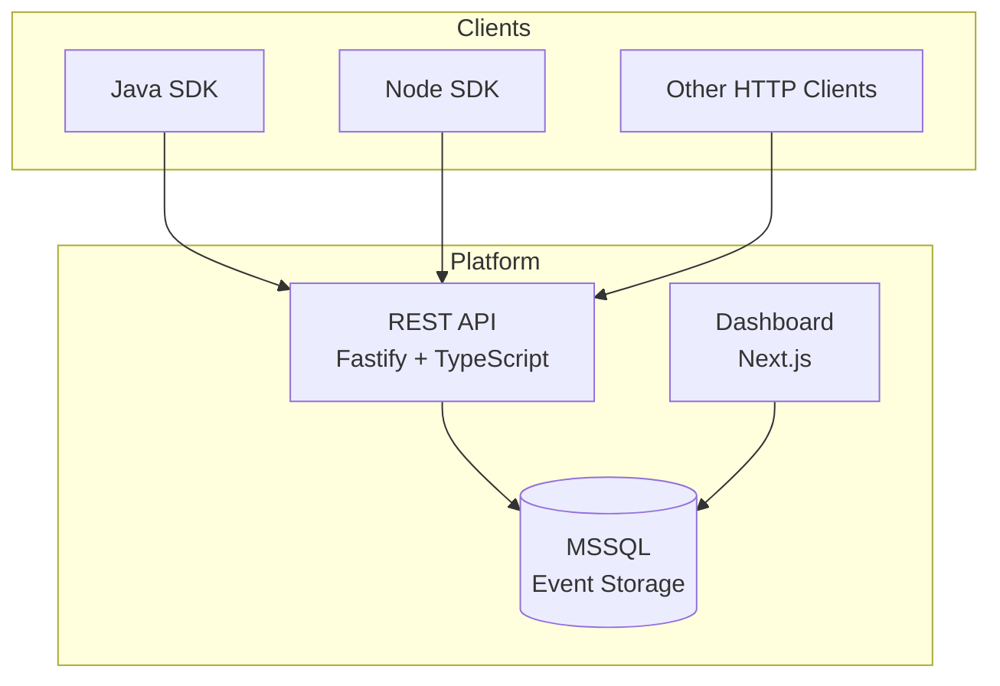
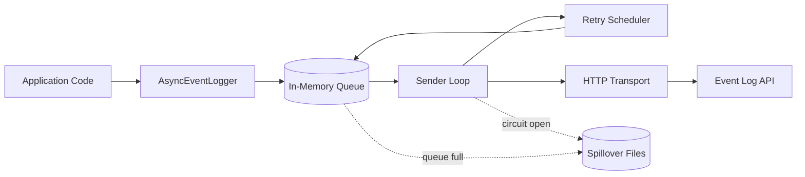

# Platform Architecture

The Event Log Platform consists of several components that work together to provide centralized event logging.

## High-Level Overview

## Components

### REST API

The API is built with **Fastify v5** and **TypeScript**, using:

- **Drizzle ORM** for database access
- **Zod** for request/response validation
- **OpenAPI 3.1** auto-generated from Zod schemas

The API handles event ingestion, querying, batch operations, correlation links, and process definitions. All endpoints are prefixed with `/v1`.

### SDKs

Both SDKs follow the same architectural pattern:

1. **Synchronous client** (`EventLogClient`) — direct HTTP calls with retry
2. **Async logger** (`AsyncEventLogger`) — fire-and-forget queue with background sender

### Dashboard

The dashboard is built with **Next.js 16** and **React 19**, connecting directly to MSSQL for read queries. It provides:

- Trace list with filtering and search
- Trace detail with event timeline
- Aggregate statistics and success rates

### Database

MSSQL Server stores all event data. Key tables:

- **event_log** — core event storage with full-text search support
- **correlation_links** — maps correlation IDs to account IDs
- **process_definitions** — registered process metadata with SLA tracking

## Event Flow

1. Application code creates an event using the SDK
2. The `AsyncEventLogger` queues the event (non-blocking)
3. A background sender thread batches events and sends them to the API
4. The API validates the event against Zod schemas
5. The event is inserted into MSSQL
6. The dashboard queries MSSQL to display traces and events

## Distributed Tracing

The platform uses W3C Trace Context identifiers:

| Identifier | Format | Purpose |
|------------|--------|---------|
| `traceId` | 32 lowercase hex chars | Groups all events in a distributed trace |
| `spanId` | 16 lowercase hex chars | Identifies a specific operation |
| `parentSpanId` | 16 lowercase hex chars | Links child to parent operation |
| `spanLinks` | Array of 16-char hex strings | Links to causally-related spans (fork-join) |

## Resilience

Both SDKs include multiple layers of resilience:

1. **In-memory queue** — buffers events if the API is temporarily slow
2. **Retry with backoff** — retries failed sends with exponential backoff and jitter
3. **Circuit breaker** — stops sending when the API is down, auto-resets
4. **Disk spillover** (Java) / **Spillover callback** (Node) — persists events when all else fails
5. **Replay** (Java) — automatically re-delivers spilled events when the API recovers
