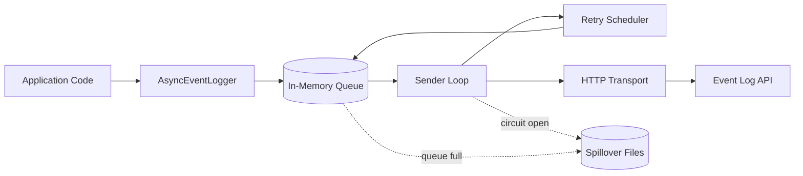

# Architecture Overview



## Notes

- The sender loop drains the queue and sends events to the API.
- Retry scheduling applies exponential backoff with jitter.
- Circuit breaker pauses sends after repeated failures.
- Spillover writes events to disk when enabled and the queue is full or API is down.

## Threading Model

`log(event)` runs on the **caller's thread** (your request thread) and does only a non-blocking `queue.offer()` — no I/O, no waiting. All other work happens on background daemon threads:

| Thread | Name | Type | Purpose |
|--------|------|------|---------|
| Sender | `eventlog-sender` | `ExecutorService` | Drains the main queue, sends events to the API via HTTP (batch or single) |
| Retry | `eventlog-retry` | `ScheduledExecutorService` | Schedules failed events for re-delivery after exponential backoff with jitter |
| Spillover | `eventlog-spillover` | `ExecutorService` | Polls the spillover queue and appends events to the JSONL file on disk |
| Replay | `eventlog-replay` | `ScheduledExecutorService` | Runs at a fixed interval (default 10s), rotates the spillover file and re-sends spilled events |

```
Request Thread                Background Threads
──────────────                ──────────────────
service.doWork()
  │
  └─ eventLogger.log(event)
       │
       └─ queue.offer(event)   ← returns immediately
            │
            │                   eventlog-sender
            │                     ├─ success → done
            │                     └─ failure → eventlog-retry
            │                                    └─ still failing → eventlog-spillover
            │                                                         └─ API recovers → eventlog-replay
            │
       return true
```

- All background threads are **daemon threads** — they won't prevent JVM shutdown.
- The sender thread count is configurable via `senderThreads` (default: 1).
- With `virtualThreads: true`, all background threads use Java 21 virtual threads instead of platform threads.
- Thread safety: `AsyncEventLogger` is fully thread-safe. A single instance should be shared across the application.
