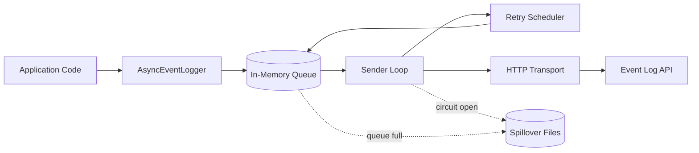

# Architecture Overview

## Notes

- The sender loop drains the queue and sends events to the API.
- Retry scheduling applies exponential backoff with jitter.
- Circuit breaker pauses sends after repeated failures.
- Spillover writes events to disk when enabled and the queue is full or API is down.
